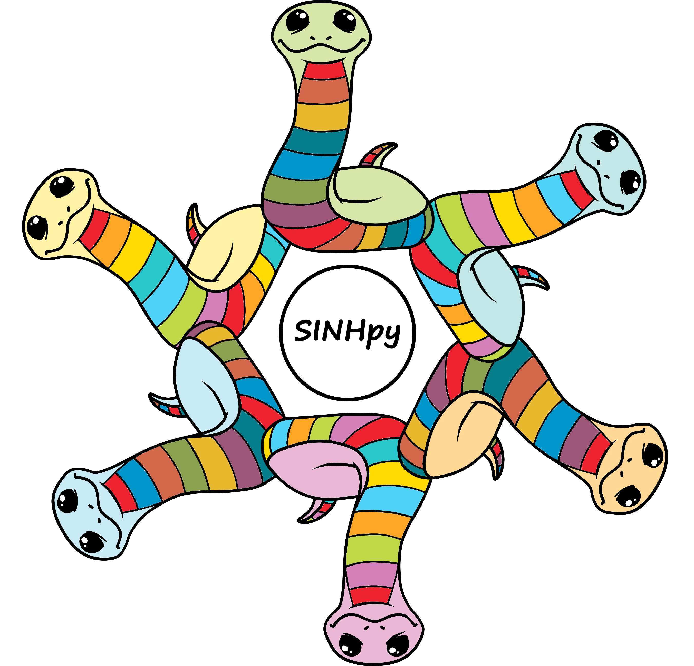

# `sihnpy`: *S*tudy of *I*nter-individual *H*eterogeneity of *N*euroimaging in *Py*thon



**Hi! Welcome to `sihnpy`!**

A critical ongoing issue in science is the lack of diversity in our study populations: some groups of individuals are often under-represented, if represented at all. This becomes particularly critical when considering health research. **How can we know that a drug tested in men will work in women? How can we know that symptoms Alzheimer's disease will present in the same way despite everyone's different life trajectories?** 

That's not all. Even when we take a group of individuals that are traditionally considered to be quite homogenous (let's say young adults), we are realizing that **their brains are actually quite different from one another**.[^Mueller_2013],[^Finn_2015] This goes hand-in-hand with the new wave of personalized medicine: if everyone has different circumstances and backgrounds, shouldn't we personalize how we conduct research and deliver healthcare? But this is also difficult to pursue as most of the traditional statistical analyses we have are made to **compare groups** or to **observe a variable within a single group.**

**This is where `sihnpy` comes in.** My goal was to provide researchers with an easy-to-use, one-stop-shop for simple methods aimed at studying inter-individual differences. During my PhD, I focused on using methods that could help us better understand these differences, or at the very least, offer more diversity in the way we can study a "traditionally" homogenous group.

Neuroscientist by training, most of the tools I develop in `sihnpy` are neuroimaging-focused. That said, with a few exceptions, the tools should also be useable in other domains. Also, I am not a computer scientist, but I really love coding and I am eagerly learning as I develop `sihnpy`. If something is not working right, feel free to [open an issue](https://github.com/stong3/sihnpy/issues) to let me know or to discuss how I can improve `sihnpy`.

## Authors
- Frédéric St-Onge - MSc - PhD candidate at McGill University
- Gabriel St-Onge - MSc

If you use `sinhpy` in your academic work (or well, any other work where you would need such a package), please consider citing the paper detailing the development of the first few modules of this package and/or citing the package (example below in APA form):

- St-Onge F, Javanray M, Pichet Binette A, Strikwerda-Brown C, Remz J, Spreng RN, Shafiei G, Misic B, Vachon-Presseau E, Villeneuve S. (2023) Functional connectome fingerprinting across the lifespan. Under review.
- St-Onge F & St-Onge G (2023). sihnpy: Study of Inter-individual Heterogeneity of Neuroimaging in Python. v[VERSION HERE], URL: https://github.com/stong3/sihnpy

## Installation

You can install the most recent version of `sinhpy` using pip:

```bash
$ pip install sihnpy
```

Head to our Github page to take a look at the code more closely: https://github.com/stong3/sihnpy

## Usage

The package is separated in distinct modules with their own rationale, explanation, use cases and limitations. Please visit the documentation for specific information on each module. Below is a quick summary of each available module:

   - **Datasets**: Contains a subset of the PREVENT-AD Open data which can be used to test functionalities of the package
   - **Fingerprinting**: Computes individual-specific signatures of variables and the related metrics
   - **Spatial extent**: Computes individual-specific measures of how "abnormal" regions across the brain are compared to pre-computed thresholds
   - **Sliding-window**: Sample selection tool to create overlapping subgroups of individuals within a sample

While I try my best to simplify the concepts as much as possible, note that **an understanding of Python's basics is probably necessary** to run most of the modules.

## Contributing

Interested in contributing? Check out the contributing guidelines. Please note that this project is released with a Code of Conduct. By contributing to this project, you agree to abide by its terms.

## License

`sihnpy` was created by Frédéric St-Onge. It is licensed under the terms of the MIT license.

Note that `sihnpy` is shipped with a small subset of the [PREVENT-AD dataset](https://portal.conp.ca/dataset?id=projects/preventad-open-bids). These data are provided in open access through the generosity and hard work of the SToP-AD center at the Douglas Mental Health University Institute affiliated with McGill University, Montreal, Canada. Using these data to test the functionalities of the software is encouraged. However, users using the `datasets` module agree to the terms of use of the PREVENT-AD dataset (see [License](license.md) for more information).

## Credits

The package was developed in part from the input of members from the [VilleneuveLab](http://www.villeneuvelab.com/en/home/). Come see the awesome work we do on aging and Alzheimer's disease!

`sihnpy` was created with [`cookiecutter`](https://cookiecutter.readthedocs.io/en/latest/) and the `py-pkgs-cookiecutter` [template](https://github.com/py-pkgs/py-pkgs-cookiecutter). This package was developped alongside my reading of the book *Python packages*, an open-source book written by Tomas Beuzen & Tiffany Timbers, available [here](https://py-pkgs.org/welcome) detailing how to create a Python package from A to Z.

The logo of the package used a [copyright-free image from Pixabay](https://pixabay.com/vectors/snake-animal-line-art-serpent-6158325/) created by the user StarGlade, which was modified to create `sihnpy`'s logo.

We thank the [PREVENT-AD cohort](https://douglas.research.mcgill.ca/prevent-alzheimer-program/) coordinating team from the [SToP-Alzheimer Center](https://douglas.research.mcgill.ca/stop-ad-centre/) at the [Douglas Mental Health University Institute](https://douglas.research.mcgill.ca/) affiliated with [McGill University](https://www.mcgill.ca/) as they are responsible for the data collection. Special thanks to Jennifer Tremblay-Mercier, coordinator at the SToP-Alzheimer center, and Dr. Sylvia Villeneuve, director of the SToP-Alzheimer center, for allowing the sharing of the data. Importantly, we would also like to thank the participants of the PREVENT-AD cohort, without whom we would not be able to have these data.

The download of the data was made possible by the support from the [Canadian Open Neuroscience Platform (CONP)](https://conp.ca), which is currently storing the data for open access. The CONP is funded in part by [Brain Canada](https://braincanada.ca/), in partnership with [Health Canada](https://www.canada.ca/en/health-canada.html).

We also acknowledge the support received by Calcul Québec and the Digital Research Alliance of Canada (DRAC) in the development of `sihnpy`. Many of the functionalities in `sihnpy` were tested and developped on a high performance computing environment such as [Beluga](https://www.calculquebec.ca/en/communiques/beluga-a-supercomputer-for-science-2/). The preprocessing and storage of the Prevent-AD data available in `sihnpy` was also executed on Beluga.

I was also financially supported by the [Fonds de Recherche du Québec - Santé](https://frq.gouv.qc.ca/en/), the [Healthy Brains for Healthy Lives initiative](https://www.mcgill.ca/hbhl/) and [Mitacs](https://www.mitacs.ca/en) at different point during my studies and the development of this software. 

**The funding organizations mentioned above did not participate in the decision making process involved in the development of the software.**

## References

[^Mueller_2013]: Mueller et al. (2013). Neuron. [10.1016/j.neuron.2012.12.028](https://doi.org/10.1016/j.neuron.2012.12.028)
[^Finn_2015]: Finn et al. (2015). Nat Neuro. [10.1038/nn.4135](https://doi.org/10.1038/nn.4135)