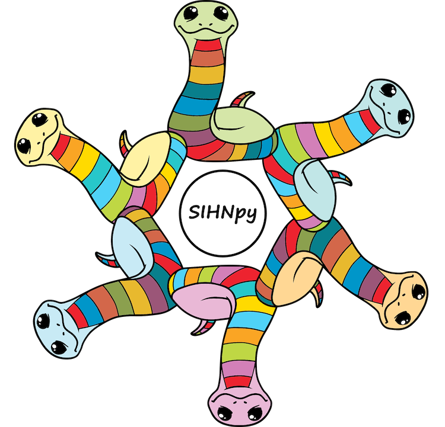

# `sihnpy`: *S*tudy of *I*nter-individual *H*eterogeneity of *N*euroimaging in *Py*thon



Hi! Welcome to `sinhpy`!

My goal in creating `sinhpy` goal was to provide researchers with an easy-to-use, one-stop-shop for simple methods aimed at studying inter-individual differences in neuroimaging. That said, many of the methods can also be applied to other types of large datasets with a lot of information on individual participants!

Over the past few years, studies using multiple brain imaging modalities have highlighted that individuals in homogenous groups tend to show considerable inter-individual differences. This leads to several challenges:
1) Comparing groups considered to be relatively homogenous may lead to hard-to-reproduce results as individual variability will not be the same from cohort to cohort
2) Developping biomarkers and treatments using group-based methods may not suit all participants, particularly when a specific disease shows a lot of heterogeneity

As such, during my PhD, I aimed to study these inter-individual differences in aging and Alzheimer's disease. However, many times I got stuck as either there was no package existing to study a specific measure of inter-individual differences, the package was written in a different programming language or was difficult to use. 

This lead us to develop `sinhpy`, as a way to adapt and store existing methodology and create new methods to study inter-individual differences. Full documentation available here: (LINK)

Please note that I do not have a formal computing background and I am learning software development as the package moves forward. I welcome any advice and contribution you may have!

## Authors
* Frédéric St-Onge - MSc - PhD candidate at McGill University
* Gabriel St-Onge - MSc - Research Scientist for the Department of National Defence of Canada

If you use `sinhpy`, please consider citing the paper detailing the development of the first few modules of this package (REF).
Also consider citing the package directly: (ADD CITATION)

## Installation

You can install the most recent version of `sinhpy` using pip:

```bash
$ pip install sihnpy
```

## Usage

To start, simply choose which module insterest you. The package is still in its infancy and doesn't contain a whole lot of module.

The documentation (link) contains all the necessary info. Each module is introduced and examples of use are given. Below are the currently available modules

- Datasets: Contains the Prevent-AD data which can be used to test other functionalities of the package
- Fingerprinting: Computes individual-specific brain signatures of each individual and the related metrics

## Contributing

Interested in contributing? Check out the contributing guidelines. Please note that this project is released with a Code of Conduct. By contributing to this project, you agree to abide by its terms.

## License

`sihnpy` was created by Frederic St-Onge. It is licensed under the terms of the MIT license.

Note that `sihnpy` is shipped with a small subset of the [Prevent-AD dataset](https://portal.conp.ca/dataset?id=projects/preventad-open-bids). These data are provided in open access through the generosity of the SToP-AD center at the Douglas Mental Health University Institute affiliated with McGill University, Montreal, Canada. Using these data to test the functionalities of the software is encouraged. However, users using the `datasets` module agree to the terms of use of the Prevent-AD dataset (see [License](license.md) for more information).

## Credits

`sihnpy` was created with [`cookiecutter`](https://cookiecutter.readthedocs.io/en/latest/) and the `py-pkgs-cookiecutter` [template](https://github.com/py-pkgs/py-pkgs-cookiecutter). This package was developped alongside my reading of the book *Python packages*, an open-source book written by Tomas Beuzen & Tiffany Timbers, available [here](https://py-pkgs.org/welcome).

The logo of the package used a [copyright-free image from Pixabay](https://pixabay.com/vectors/snake-animal-line-art-serpent-6158325/) created by the user StarGlade, which was modified to create `sihnpy`'s logo

We thank the Prevent-AD cohort coordinating team from the SToP-Alzheimer Center at the Douglas Mental Health University Institute affiliated with McGill University as it is thanks to them that data was able to be included in the package. Special thanks to Jennifer Tremblay-Mercier, coordinator at the SToP-Alzheimer center, and Dr. Sylvia Villeneuve, director of the SToP-Alzheimer center, for allowing the sharing of the data. Importantly, we would also like to thank the participants of the Prevent-AD cohort, without whom we would not be able to have these data.

We also acknowledge the support received by Calcul Québec and the Digital Research Alliance of Canada (DRAC) in the development of `sihnpy`. Many of the functionalities in `sihnpy` were developped to be able to be tested and run in a high performance computing environment such as [Beluga](https://www.calculquebec.ca/en/communiques/beluga-a-supercomputer-for-science-2/). The preprocessing and storage of the data available in `sihnpy` (functional connectivity) was also executed on Beluga.